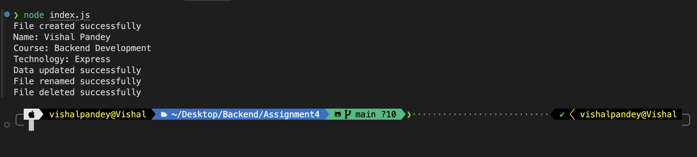

# Assignment 3

This assignment demonstrates basic Node.js file system operations using the built-in `fs` module.

## What the script does

The `index.js` file performs the following steps:

1. Creates a file named `student.txt`
2. Writes student details into the file
3. Reads the file content and prints it to the console
4. Appends additional details
5. Renames `student.txt` to `studentDetails.txt`
6. Deletes the renamed file

## How to run

Make sure Node.js is installed, then run:

```bash
node index.js
```

## Output

The screenshot below shows the terminal output produced by the script:



## Notes

- The file is deleted at the end of the script, so no text file remains after execution.
- The screenshot in `output.png` shows the full flow of file creation, update, rename, and deletion.
