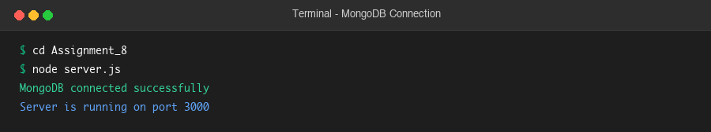
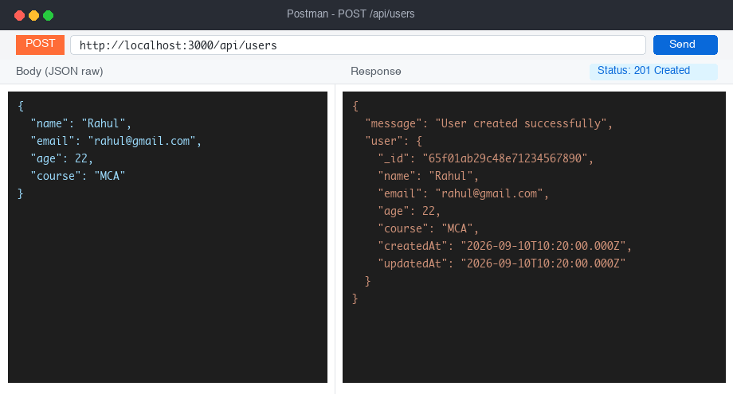
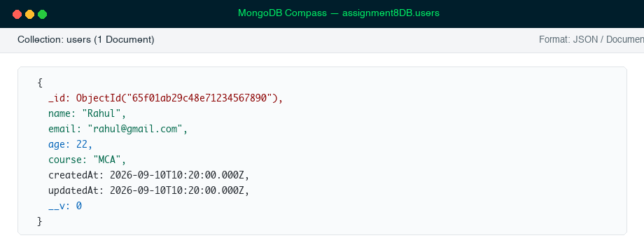
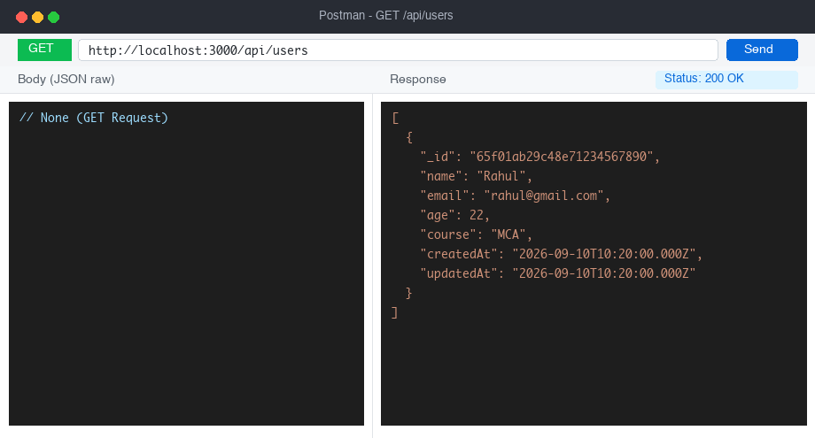

# Assignment 8: Create and Retrieve Users Using Express, MongoDB and Mongoose

## 👨‍💻 Student Details

* **Name:** Vishal
* **Roll Number:** 150096725178
* **Course:** Backend Development (Node.js & MongoDB)
* **Assignment:** Question 1 — Create and Retrieve Users Using Express, MongoDB and Mongoose (Assignment 8)

---

## 🎯 Objective

Create an Express.js application that connects to a **MongoDB** database using **Mongoose**, allowing users to:
1. **Create/Add** new user data to MongoDB via `POST /api/users`.
2. **Retrieve** all user data from MongoDB as a JSON response via `GET /api/users`.

---

## 📁 Required Folder Structure

```text
Assignment_8/
│
├── server.js               # Express application entry point & MongoDB connection
│
├── schema/
│   └── userSchema.js       # Mongoose User schema definition
│
├── model/
│   └── userModel.js        # Mongoose User model
│
├── router/
│   └── userRouter.js       # Express router for POST and GET /api/users
│
├── screenshots/
│   ├── 1_mongodb_connected.png      # MongoDB connection success screenshot
│   ├── 2_post_create_user.png       # Successful POST request screenshot
│   ├── 3_mongodb_data_stored.png    # Data stored in MongoDB Compass screenshot
│   └── 4_get_all_users.png          # Successful GET request screenshot
│
├── package.json
└── README.md
```

---

## 🚀 Technologies Used

* **Node.js** (JavaScript Runtime)
* **Express.js** (Web Application Framework)
* **MongoDB** (NoSQL Database)
* **Mongoose** (Object Data Modeling Library for MongoDB)

---

## ⚙️ Installation & Setup

1. **Install Dependencies:**
   ```bash
   cd Assignment_8
   npm install
   ```

2. **Ensure MongoDB is Running:**
   ```bash
   mongod
   ```

3. **Start the Express Server:**
   ```bash
   node server.js
   ```

   **Terminal Output on Startup:**
   ```text
   MongoDB connected successfully
   Server is running on port 3000
   ```

---

## 📋 Schema Definition (`schema/userSchema.js`)

The User schema defines the structure and validation for documents in the `users` collection:

| Field | Type | Rules |
| :--- | :--- | :--- |
| `name` | String | **Required**, trimmed string |
| `email` | String | **Required**, unique, trimmed, lowercase string |
| `age` | Number | **Required**, number > 0 |
| `course` | String | **Required**, trimmed string |
| `createdAt` / `updatedAt` | Date | Automatically managed timestamps |

---

## 💻 API Endpoints

### 1. Create User
* **Method:** `POST`
* **URL:** `http://localhost:3000/api/users`
* **Headers:** `Content-Type: application/json`
* **Request Body:**
  ```json
  {
    "name": "Rahul",
    "email": "rahul@gmail.com",
    "age": 22,
    "course": "MCA"
  }
  ```
* **Success Response (`201 Created`):**
  ```json
  {
    "message": "User created successfully",
    "user": {
      "_id": "65f01ab29c48e71234567890",
      "name": "Rahul",
      "email": "rahul@gmail.com",
      "age": 22,
      "course": "MCA",
      "createdAt": "2026-09-10T10:20:00.000Z",
      "updatedAt": "2026-09-10T10:20:00.000Z"
    }
  }
  ```

---

### 2. Retrieve All Users
* **Method:** `GET`
* **URL:** `http://localhost:3000/api/users`
* **Success Response (`200 OK`):**
  ```json
  [
    {
      "_id": "65f01ab29c48e71234567890",
      "name": "Rahul",
      "email": "rahul@gmail.com",
      "age": 22,
      "course": "MCA",
      "createdAt": "2026-09-10T10:20:00.000Z",
      "updatedAt": "2026-09-10T10:20:00.000Z"
    }
  ]
  ```

---

## 🛡️ Error Handling & Status Codes

| Scenario | HTTP Status | Response |
| :--- | :---: | :--- |
| **Missing required fields** | `400 Bad Request` | `{"error": "Validation error: Name, email, age, and course are required."}` |
| **Duplicate email** | `409 Conflict` | `{"error": "User with this email already exists."}` |
| **Database error** | `500 Internal Server Error` | `{"error": "Database error while creating user", "details": "..."}` |

---

## 📸 Submission Screenshots

### 1. MongoDB Connected Successfully
Terminal showing the Express server running and MongoDB connection established:


---

### 2. Successful POST Request
Postman / API Client showing `POST /api/users` with `201 Created` response:


---

### 3. Data Stored in MongoDB
MongoDB Compass showing the newly created document inside the `users` collection:


---

### 4. Successful GET Request
Postman / API Client showing `GET /api/users` returning all user documents with `200 OK`:


---

## 📊 Rubric Alignment (10 Marks)

| Criteria | Marks | Description & Implementation |
| :--- | :---: | :--- |
| **Express Server & MongoDB Connection** | 2 | Correctly connects Express server to MongoDB using Mongoose and logs success message |
| **Folder Structure** | 1 | Strictly maintains separated `schema/`, `model/`, `router/`, and `server.js` |
| **Schema Creation** | 1 | Creates Mongoose user schema in `schema/userSchema.js` with required fields |
| **Model Creation** | 1 | Creates and exports User model in `model/userModel.js` |
| **Router Implementation** | 1 | Creates `router/userRouter.js` and mounts it in `server.js` |
| **POST API** | 1 | Correctly accepts user data and saves it to MongoDB |
| **GET API** | 1 | Correctly retrieves all users from MongoDB and returns JSON |
| **Connection & Operation Messages** | 1 | Displays clear, meaningful connection and operation messages |
| **Code Quality** | 1 | Clean, readable, modular code adhering to best practices |
| **Total** | **10 Marks** | |
