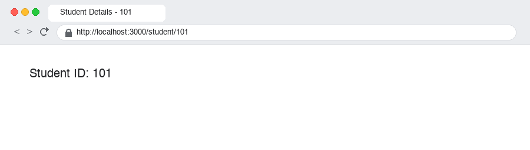
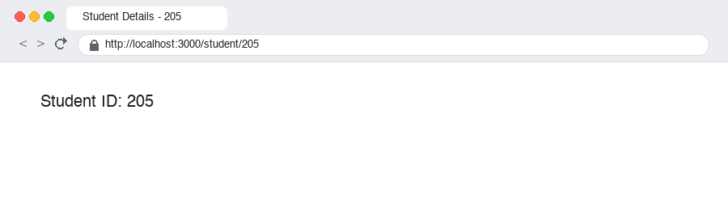
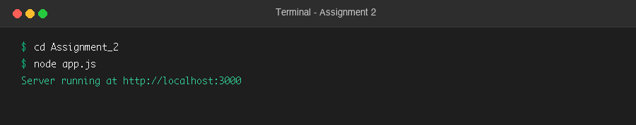
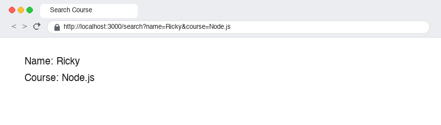
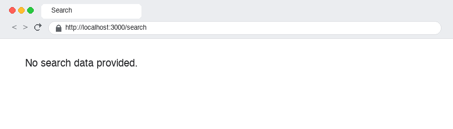
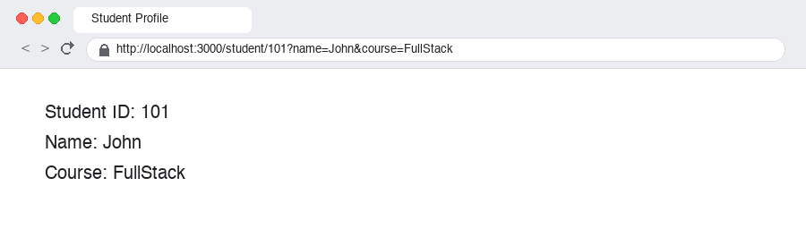

# Express.js Route Parameters & Query Parameters Assignments

This repository contains three Express.js assignments demonstrating dynamic routing using **Route Parameters (`req.params`)** and **Query Parameters (`req.query`)**.

---

## 📚 Assignments Overview

| Assignment | Topic | Route | Parameter Type | Example URL |
| :--- | :--- | :--- | :--- | :--- |
| **Assignment 1** | Route Parameters | `/student/:id` | Route Parameter (`req.params`) | `http://localhost:3000/student/101` |
| **Assignment 2** | Query Parameters | `/search` | Query Parameter (`req.query`) | `http://localhost:3000/search?name=Ricky&course=Node.js` |
| **Assignment 3** | Combined Route & Query Parameters | `/student/:id` | Route & Query Parameters | `http://localhost:3000/student/101?name=John&course=FullStack` |

---

# 🚀 Technologies Used

* **Node.js** (JavaScript Runtime Environment)
* **Express.js** (Fast, unopinionated minimalist web framework)
* **JavaScript (ES6+)**
* **npm** (Node Package Manager)

---

# 📋 Prerequisites

Before running the projects, make sure you have installed:

* [Node.js](https://nodejs.org/) (v16+ recommended)
* npm (comes bundled with Node.js)

Verify your installation in terminal:

```bash
node -v
npm -v
```

---

# 📁 Project Structure

```text
route_parameter_Ass7/
│
├── Assignment_1/
│   ├── app.js
│   └── package.json
│
├── Assignment_2/
│   ├── app.js
│   └── package.json
│
├── Assignment_3/
│   ├── app.js
│   └── package.json
│
├── screenshots/
│   ├── assignment1_student_101.png
│   ├── assignment1_student_205.png
│   ├── assignment1_terminal.png
│   ├── assignment2_search_with_query.png
│   ├── assignment2_search_empty.png
│   ├── assignment2_terminal.png
│   ├── assignment3_student_profile.png
│   └── assignment3_terminal.png
│
├── package.json
└── README.md
```

---

# 1️⃣ Assignment 1 — Route Parameters (10 Marks)

## 🎯 Objective
Implement dynamic routing using **Route Parameters** in Express.js.

## 📝 Problem Statement
Develop an Express.js application that:
* Creates a route `/student/:id`.
* Extracts the student ID using route parameters (`req.params.id`).
* Displays the message in the browser: `Student ID: <id>`.
* If the user visits `/student/101`, the application displays `Student ID: 101`.
* If the user visits `/student/205`, the application displays `Student ID: 205`.

## 💻 Code Implementation (`Assignment_1/app.js`)

```javascript
const express = require("express");

const app = express();
const PORT = process.env.PORT || 3000;

// Home route
app.get("/", (req, res) => {
    res.send("Assignment 1: Route Parameters. Try visiting /student/101 or /student/205");
});

// Dynamic Route using Route Parameter
app.get("/student/:id", (req, res) => {
    const { id } = req.params;
    res.send(`Student ID: ${id}`);
});

app.listen(PORT, () => {
    console.log(`Server running at http://localhost:${PORT}`);
});
```

## 💻 Routes

| Method | Route | Description | Response Example |
| :--- | :--- | :--- | :--- |
| `GET` | `/` | Home / 안내 page | Information message |
| `GET` | `/student/:id` | Dynamic route with student ID | `Student ID: 101` |

## ▶️ How to Run

```bash
cd Assignment_1
npm install
node app.js
```

Server starts at: `http://localhost:3000`

## 🌐 Expected Output

### 1. Visiting `/student/101`
* **URL:** `http://localhost:3000/student/101`
* **Browser Display:**
  ```text
  Student ID: 101
  ```

### 2. Visiting `/student/205`
* **URL:** `http://localhost:3000/student/205`
* **Browser Display:**
  ```text
  Student ID: 205
  ```

## 📸 Screenshots — Assignment 1

### Terminal Execution


### Browser Output (`/student/101`)


### Browser Output (`/student/205`)


---

# 2️⃣ Assignment 2 — Query Parameters (10 Marks)

## 🎯 Objective
Retrieve and display data using **Query Parameters** in Express.js.

## 📝 Problem Statement
Develop an Express.js application that:
* Creates a route `/search`.
* Accepts query parameters:
  * `name`
  * `course`
* Displays both values in the browser.
* If no query parameters are provided, displays: `No search data provided.`.

## 💻 Code Implementation (`Assignment_2/app.js`)

```javascript
const express = require("express");

const app = express();
const PORT = process.env.PORT || 3000;

// Home route
app.get("/", (req, res) => {
    res.send("Assignment 2: Query Parameters. Try visiting /search?name=Ricky&course=Node.js or /search");
});

// Route using Query Parameters
app.get("/search", (req, res) => {
    const { name, course } = req.query;

    if (!name && !course) {
        return res.send("No search data provided.");
    }

    res.send(`Name: ${name || "N/A"}<br>Course: ${course || "N/A"}`);
});

app.listen(PORT, () => {
    console.log(`Server running at http://localhost:${PORT}`);
});
```

## 💻 Routes

| Method | Route | Description | Response Example |
| :--- | :--- | :--- | :--- |
| `GET` | `/` | Home / Info route | Assignment information |
| `GET` | `/search?name=...&course=...` | Search with query parameters | `Name: Ricky`<br>`Course: Node.js` |
| `GET` | `/search` | Search without parameters | `No search data provided.` |

## ▶️ How to Run

```bash
cd Assignment_2
npm install
node app.js
```

Server starts at: `http://localhost:3000`

## 🌐 Expected Output

### 1. With Query Parameters
* **URL:** `http://localhost:3000/search?name=Ricky&course=Node.js`
* **Browser Display:**
  ```text
  Name: Ricky
  Course: Node.js
  ```

### 2. Without Query Parameters
* **URL:** `http://localhost:3000/search`
* **Browser Display:**
  ```text
  No search data provided.
  ```

## 📸 Screenshots — Assignment 2

### Terminal Execution


### Browser Output (With Query Parameters)


### Browser Output (Without Query Parameters)


---

# 3️⃣ Assignment 3 — Student Profile using Route & Query Parameters (10 Marks)

## 🎯 Objective
Build a dynamic route that uses **both Route Parameters and Query Parameters** together.

## 📝 Problem Statement
Develop an Express.js application that:
* Creates a route `/student/:id`.
* Retrieves the student ID using route parameters (`req.params.id`).
* Accepts the following query parameters (`req.query`):
  * `name`
  * `course`
* Displays all student details in the browser.

## 💻 Code Implementation (`Assignment_3/app.js`)

```javascript
const express = require("express");

const app = express();
const PORT = process.env.PORT || 3000;

// Home route
app.get("/", (req, res) => {
    res.send("Assignment 3: Route Parameters & Query Parameters. Try visiting /student/101?name=John&course=FullStack");
});

// Dynamic route with both Route Parameters and Query Parameters
app.get("/student/:id", (req, res) => {
    const { id } = req.params;
    const { name, course } = req.query;

    res.send(`Student ID: ${id}<br>Name: ${name || "N/A"}<br>Course: ${course || "N/A"}`);
});

app.listen(PORT, () => {
    console.log(`Server running at http://localhost:${PORT}`);
});
```

## 💻 Routes

| Method | Route | Parameters | Response Example |
| :--- | :--- | :--- | :--- |
| `GET` | `/` | None | Home info |
| `GET` | `/student/:id?name=...&course=...` | Route param `:id`, Query params `name`, `course` | `Student ID: 101`<br>`Name: John`<br>`Course: FullStack` |

## ▶️ How to Run

```bash
cd Assignment_3
npm install
node app.js
```

Server starts at: `http://localhost:3000`

## 🌐 Expected Output

* **URL:** `http://localhost:3000/student/101?name=John&course=FullStack`
* **Browser Display:**
  ```text
  Student ID: 101
  Name: John
  Course: FullStack
  ```

## 📸 Screenshots — Assignment 3

### Terminal Execution


### Browser Output (Student Profile)


---

# 🔑 Key Concepts & Differences

### Route Parameters (`req.params`) vs Query Parameters (`req.query`)

| Feature | Route Parameters (`req.params`) | Query Parameters (`req.query`) |
| :--- | :--- | :--- |
| **Syntax in Route** | `app.get("/student/:id", ...)` | `app.get("/search", ...)` |
| **URL Example** | `http://localhost:3000/student/101` | `http://localhost:3000/search?name=Ricky&course=Node.js` |
| **Access Property** | `req.params.id` | `req.query.name`, `req.query.course` |
| **Primary Purpose** | Identifying a specific resource or entity | Filtering, sorting, searching, or passing optional data |
| **Requirement** | Mandatory part of the URL path structure | Optional key-value pairs appended after `?` |

---

# 📊 Grading Rubric (10 Marks per Assignment)

| Criteria | Marks | Description |
| :--- | :---: | :--- |
| **Correct implementation of dynamic routes/queries** | 3 | Proper route definition for dynamic segments and query handlers |
| **Proper use of `req.params` and/or `req.query`** | 2 | Clean parameter extraction and destructuring |
| **Correct functionality and expected output** | 2 | Output matches requirements across all test cases |
| **Code quality, formatting, and readability** | 2 | Clean code, proper naming conventions, and well-structured files |
| **Successful execution without errors** | 1 | Server boots cleanly and executes without crashes |
| **Total** | **10 Marks** | |

---

## 👨‍💻 Author

**Vishal Pandey** — Backend Development Assignment 7 (Route & Query Parameters)

---

## ⭐ Acknowledgement

This project was developed as part of Node.js and Express.js backend training to master dynamic routing, route parameters (`req.params`), and query strings (`req.query`).
